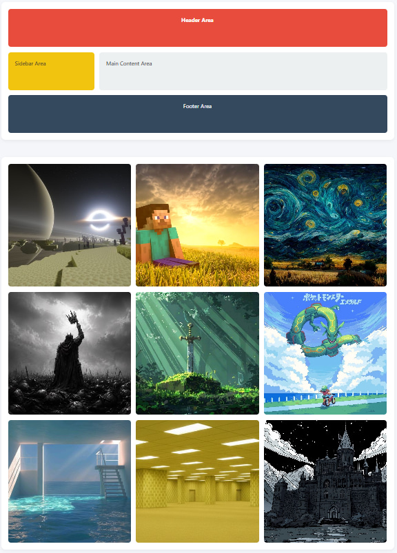

# Assignment #2: Advanced CSS (Flexbox & Grid)

**Name:** Махамбетұлы Исатай
**Group:** IT-2513

## Assignment Tasks & Screenshots

### Part 1. Flexbox
- **Task 0 & 1:** Navigation Bar and Card Row with equal heights and hover effects.

### Part 2. Grid System
- **Task 2 & 3:** Page Layout with Grid Areas and 3x3 Image Gallery with hover captions.

### Part 3. Combining Flexbox & Grid
- **Task 4:** Portfolio Page integrating Grid for layout and Flexbox for internal component alignment.

## Work Process Summary
In this assignment, I applied advanced CSS layout techniques to build responsive interfaces without relying on traditional floats. I used Flexbox for one-dimensional alignment (navigation, card contents) and CSS Grid for two-dimensional structural layouts (page areas, image gallery). Combining both allowed for a clean, scalable, and modern front-end architecture.
